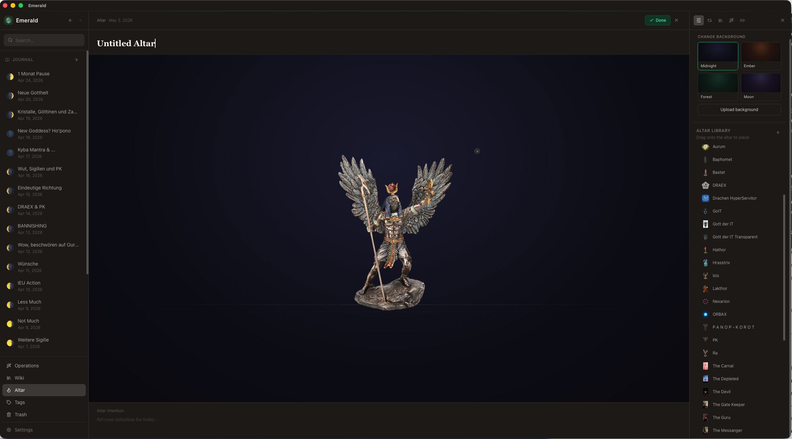
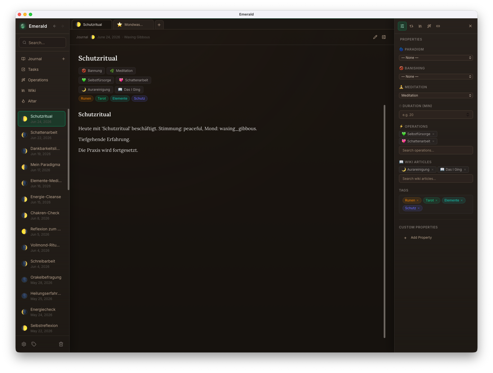
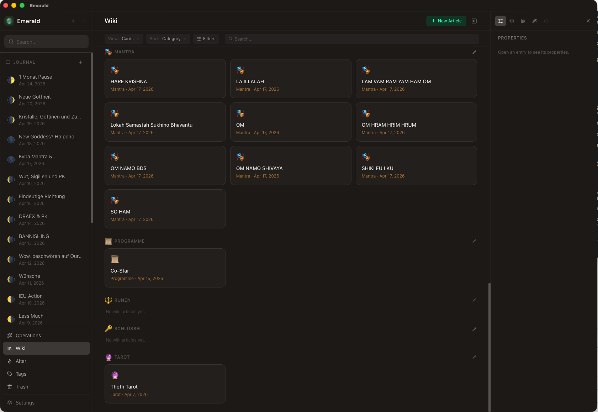
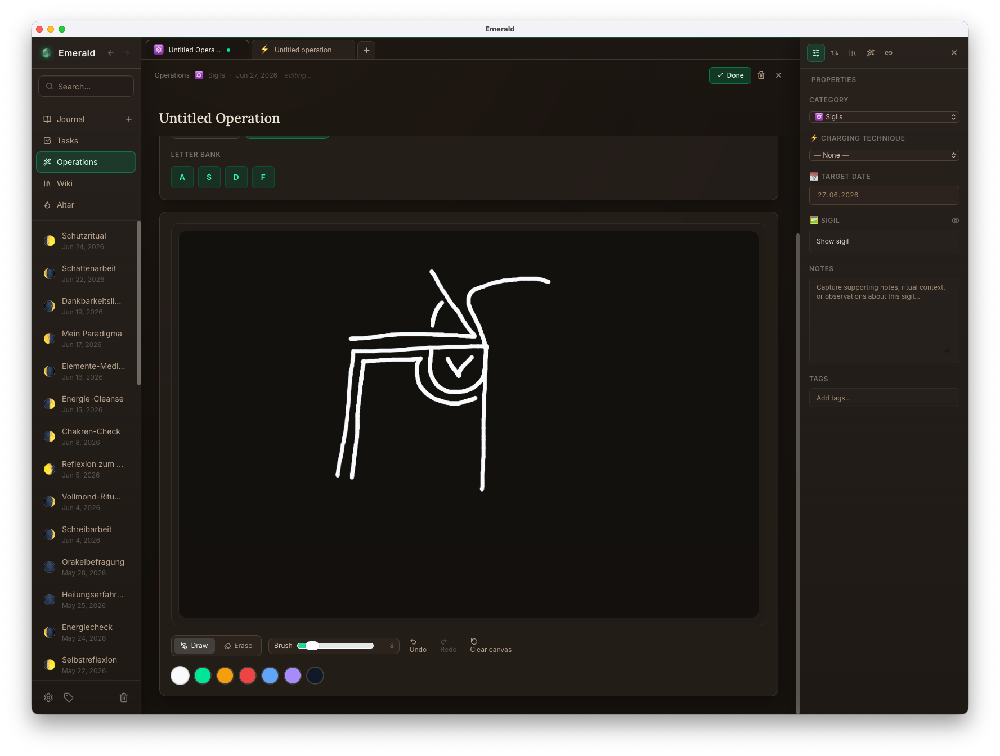
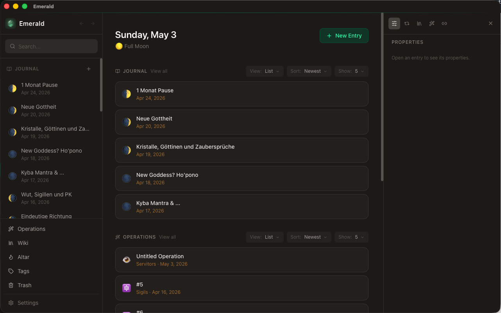

# Emerald

> A private, local-first journal for magical practice.

[](LICENSE)


Emerald is a desktop app for documenting your magical practice. Write journal entries, build a personal wiki, track rituals and operations, create sigils, and arrange a virtual altar — all stored locally in a SQLite database on your machine. No account, no cloud, no tracking.

> [!WARNING]
> **Early development.** Emerald is a personal project shared in the spirit of open source. It is functional and used daily, but not yet a polished release — expect rough edges, missing features, and breaking changes between versions. Use at your own risk and back up your data regularly.

---

## Screenshots











<table>
  <tr>
    <td></td>
    <td></td>
  </tr>
  <tr>
    <td></td>
  </tr>
  <tr>
    <td></td>
  </tr>
  <tr>
    <td></td>
  </tr>
    <td></td>
    <td></td>
  <tr>
    <td></td>
  </tr>
</table>

---

## Features

**Journal** — Rich-text entries with automatic moon phase tracking. Classify by paradigm, banishing technique, or meditation type. Link operations and wiki articles, add tags and custom properties. Full backlink graph across all content types.

**Wiki** — A personal reference library with 12 built-in category types (deities, herbs, rituals, symbols, …) and custom categories. Articles support icons, cover images, and internal links from anywhere in the app.

**Operations** — Track rituals, workings, servitors, and sigils. Mark them active or inactive, set end dates and version numbers, link wiki articles and journal entries.

**Tasks** — Hierarchical task manager with categories, priorities (Low/Medium/High), subtasks, and links to other content. Filter by category or priority, group by category, inline-edit titles. Soft-delete with trash recovery.

**Sigil Workflow** — Write your intention, reduce the letters, draw the sigil on a canvas, set a reveal date, and link a charging technique — all in one dedicated editor inside Operations.

**Altar** — A virtual altar canvas. Build a library of symbolic items, arrange them with drag-and-drop, and keep multiple altar setups with different backgrounds and intentions.

**Routines** — Reusable content templates that drop into any journal entry, automatically merging tags and linked content.

**Export / Import** — Export as PDF, Markdown, or the lossless `.emerald` format with embedded images. Import back on any machine. Full database backup and restore via `.emeralddb`.

**Multi-Vault** — Keep separate databases for different projects or traditions.

**Tabs & Workspace** — Open multiple entries, wiki articles, operations, sigils, and altars in browser-like tabs. Reorder tabs with drag-and-drop (animated) and resume the same tab set and tab order after restart.

**Localised** — English, German, Spanish, and French.

---

## Getting Started

**Prerequisites:** Node.js · Rust toolchain · [Tauri prerequisites](https://tauri.app/start/prerequisites/)

```bash
npm install
npm run tauri:dev     # dev build — uses a separate database, title "Emerald Dev"
npm run tauri build   # production build
```

The dev build keeps its own app identity (`com.emerald.magical-journal.dev`) and database, so it won't interfere with an installed production build.

If you previously installed dependencies with `sudo`, Vite may fail with `EACCES` while writing to `node_modules/.vite-temp`. The npm scripts in this repo already use `--configLoader runner` to avoid that failure, but fixing ownership is still recommended:

```bash
sudo chown -R "$USER":staff node_modules
```

---

## Documentation

| Document | Description |
|---|---|
| [Documentation/features.md](Documentation/features.md) | Full feature guide |
| [Documentation/altar.md](Documentation/altar.md) | Altar behavior, editing flows, and layout controls |
| [Documentation/architecture.md](Documentation/architecture.md) | Architecture, patterns, and data flow |
| [Documentation/database.md](Documentation/database.md) | SQLite schema and conventions |
| [Documentation/internationalization.md](Documentation/internationalization.md) | Adding and managing translations |
| [Documentation/security.md](Documentation/security.md) | Capability model and sandboxing |
| [DATABASE_SCHEMA.md](DATABASE_SCHEMA.md) | Full SQLite schema reference |

---

## Contributing

Contributions are welcome. Please read [CONTRIBUTING.md](CONTRIBUTING.md) before opening a pull request.

---

## License

Copyright (C) 2024–2026 Lukas Reuter

This program is free software: you can redistribute it and/or modify it under the terms of the GNU General Public License as published by the Free Software Foundation, either version 3 of the License, or (at your option) any later version.

See [LICENSE](LICENSE) for the full license text.
