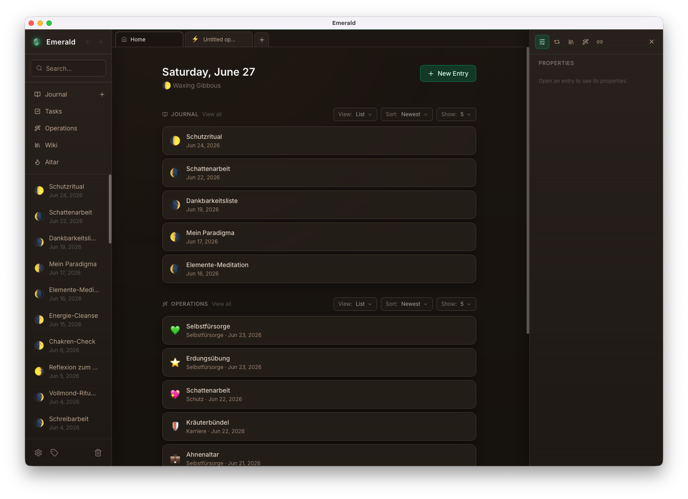
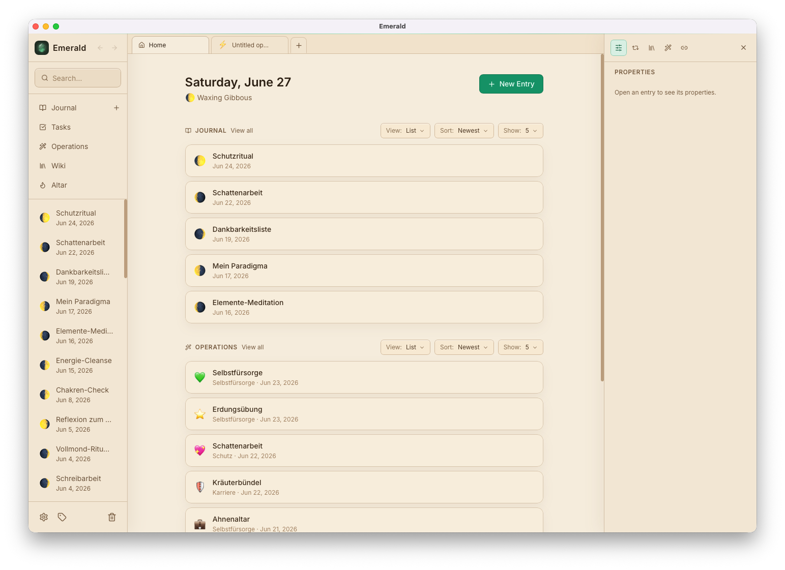
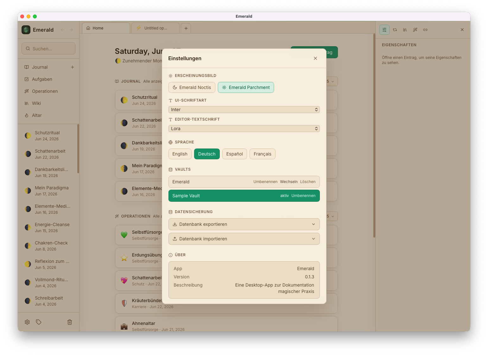
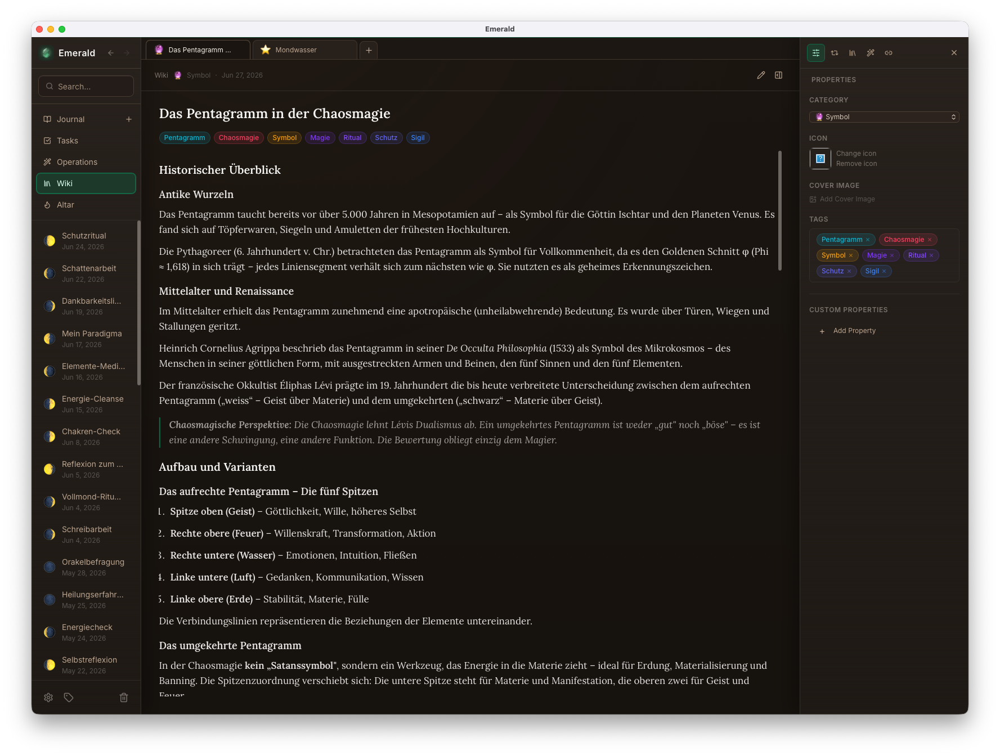
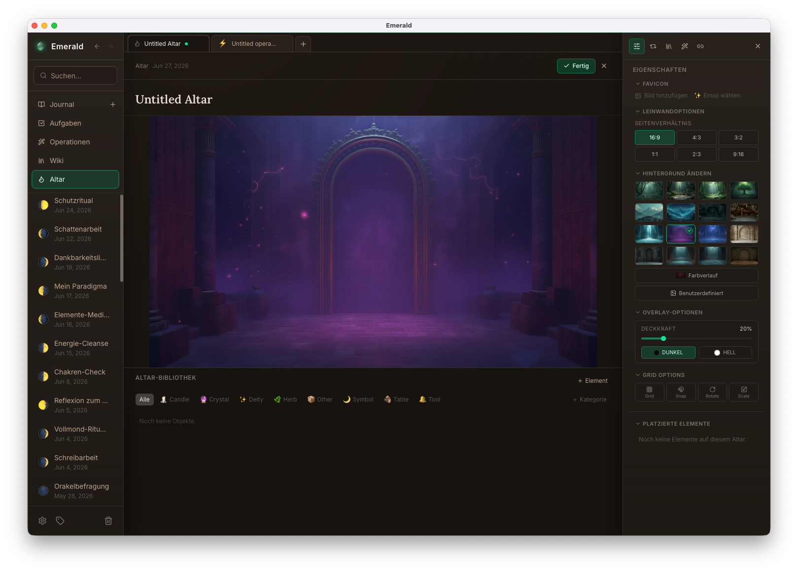
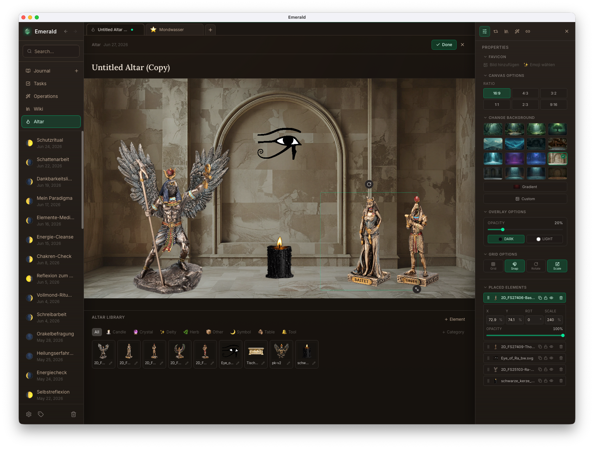
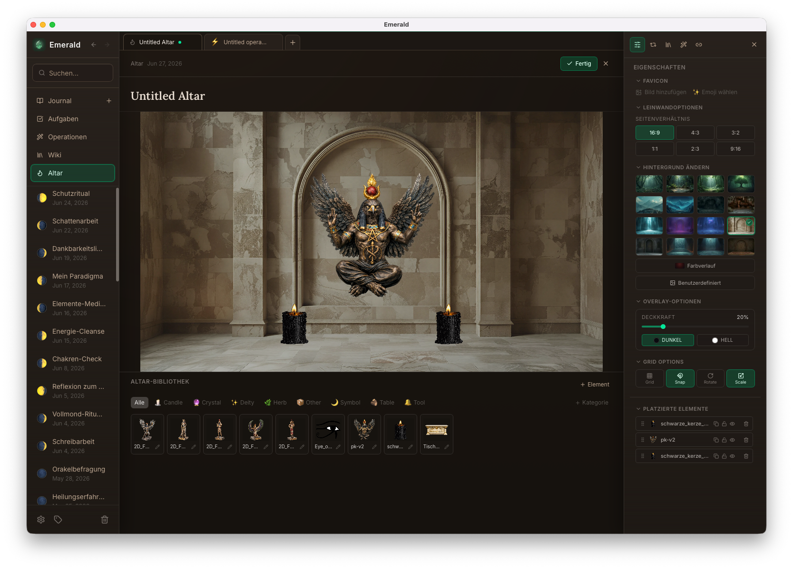

# Emerald

> A private workspace for your magical practice, built for practitioners of every tradition.

[](LICENSE)


Emerald is the private workspace for your magical practice. A journal, personal wiki, ritual tracker, sigil workshop, and virtual altar — all in one app, all on your machine. Built for practitioners of every tradition. No account, no cloud, no tracking.

> [!WARNING]
> **Early development.** Emerald is a personal project shared in the spirit of open source. It is functional and used daily, but not yet a polished release — expect rough edges, missing features, and breaking changes between versions. Use at your own risk and back up your data regularly.

---

## Screenshots
<p align="center"><em>All the Entries here are examples and partly AI generated.</em></p>

<h3 align="center">Dark & Light Theme</h3>

 

<h3 align="center">Set Theme, Font, Language and Database. Export / Import your Data.</h3>



<h3 align="center">Journal Entry. Link your Entries.</h3>


<h3 align="center">Wiki Entry.</h3>



<h3 align="center">Sigil Editor in the Operations Module</h3>


<h3 align="center">Create your custom Altar</h3>



<h5 align="center">Some Altar Examples</h5>

 


---

## Features

**Journal** — Rich-text entries (TipTap) with automatic moon phase tracking. Attach paradigm, banishing technique, and meditation type via linked wiki articles. Add free-form tags, custom properties (text, number, date, toggle, checkbox), and internal links to operations and wiki articles. Three list layouts (List, Cards, Timeline) with sort, filter by moon phase or property value, and full-text search.

**Wiki** — A personal reference library with 12 built-in category types (deities, herbs, rituals, symbols, …) and unlimited custom categories. Articles support emoji or image icons, cover images, and show backlinks from any content in the app.

**Operations** — Track rituals, workings, servitors, and sigils. Mark them active or inactive, set end dates and version strings, and attach icons and cover images. Link wiki articles and journal entries.

**Sigil Workflow** — Write your intention, auto-reduce unique letters into a letter bank, draw the sigil on a canvas, set a reveal date, link a charging technique, and mark it as loaded — all in a dedicated editor inside Operations.

**Altar** — A virtual canvas for your sacred space. Build a personal item library with fully dynamic, reorderable categories. Drag items onto the canvas and adjust position, scale, rotation, opacity, and layer order. Keep multiple altar setups with customisable backgrounds (7 gradient presets, 16 photographic presets, or a custom upload) and a dark/light overlay. Snap items to a configurable grid. Export any altar as JPEG, PNG, or WebP at full native resolution. Dashboard shows live thumbnail previews of all altars.

**Tasks** — Hierarchical task manager with unlimited subtask depth, categories, and three priority levels (Low / Medium / High). Link tasks to journal entries, wiki articles, or operations. Filter by category and priority, inline-edit titles. Soft-delete with trash recovery.

**Backlinks** — Every journal entry, wiki article, and operation shows all content that references it in a live sidebar panel.

**Routines** — Reusable content templates that drop into any journal entry, automatically merging body text, tags, and linked content.

**Export / Import** — Export entries as PDF, Markdown, or the lossless `.emerald` format with embedded images. Import back on any machine. Full database backup and restore via `.emeralddb`.

**Multi-Vault** — Keep separate SQLite databases for different projects or traditions, switchable from inside the app.

**Tabs & Workspace** — Open journal entries, wiki articles, operations, sigils, and altars in browser-like tabs. Reorder with drag-and-drop, open with middle-click, close with middle-click, and resume the full workspace after restart.

**Theming & Typography** — Two built-in themes: Emerald Noctis (dark, default) and Emerald Parchment (light). Independent font controls for the UI shell and the editor body, with 8 typeface options.

**Localised** — English, German, Spanish, and French.

---

## Getting Started

### Download

Pre-built binaries for macOS, Windows, and Linux are on the [Releases](../../releases) page.

**macOS** — The app is not notarised. Gatekeeper will block it on first launch.
Right-click the app in Finder → **Open** → confirm. After the first approval it opens normally.
Alternatively, run `sudo xattr -cr /Applications/Emerald.app` in Terminal.

**Windows** — SmartScreen may show a warning. Click **More info → Run anyway**.

### Build from source

**Prerequisites:** Node.js · Rust toolchain · [Tauri prerequisites](https://tauri.app/start/prerequisites/)

```bash
npm install
npm run tauri:dev     # dev build — separate database, title "Emerald Dev"
npm run tauri build   # production build
```

The dev build uses a separate app identity (`com.emerald.magical-journal.dev`) and database, so it won't interfere with an installed production build.

---

## Documentation

| Document | Description |
|---|---|
| [Documentation/features.md](Documentation/features.md) | Full feature guide |
| [Documentation/architecture.md](Documentation/architecture.md) | Architecture, patterns, and data flow |
| [Documentation/design.md](Documentation/design.md) | Design tokens, component patterns, and known inconsistencies |
| [Documentation/database.md](Documentation/database.md) | SQLite schema and conventions |
| [Documentation/internationalization.md](Documentation/internationalization.md) | Adding and managing translations |
| [Documentation/security.md](Documentation/security.md) | Capability model and sandboxing |

---

## Contributing

Contributions are welcome. Please read [CONTRIBUTING.md](CONTRIBUTING.md) before opening a pull request.

---

## License

Copyright (C) 2024–2026 Lukas Reuter

This program is free software: you can redistribute it and/or modify it under the terms of the GNU General Public License as published by the Free Software Foundation, either version 3 of the License, or (at your option) any later version.

See [LICENSE](LICENSE) for the full license text.
